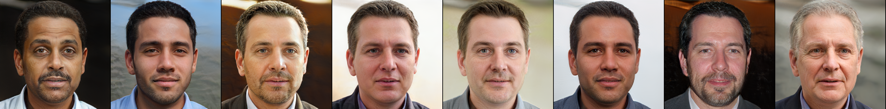
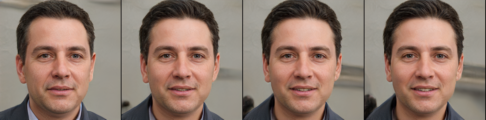
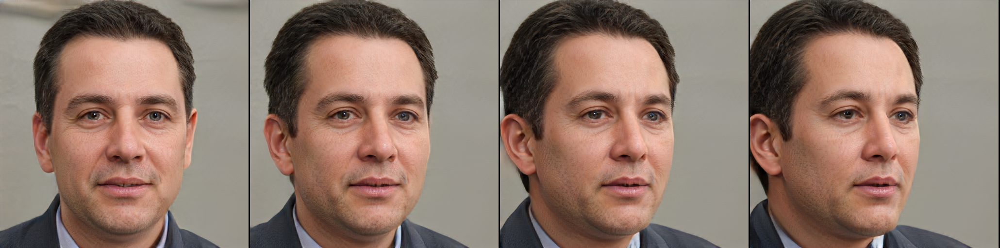
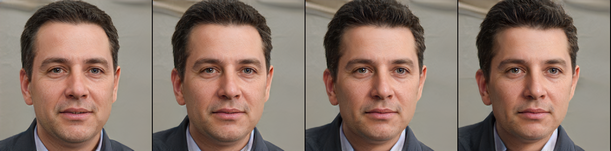
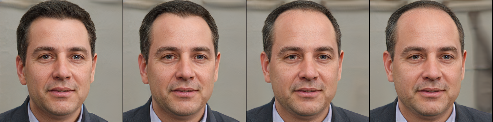
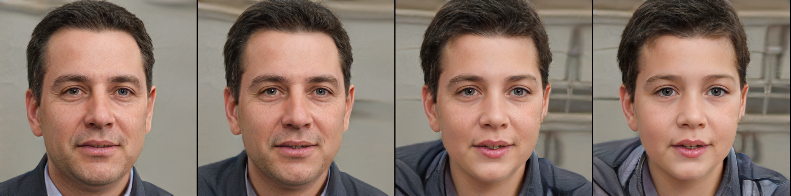
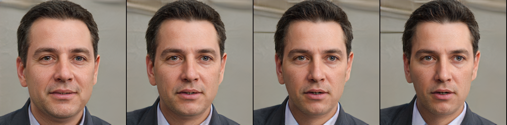
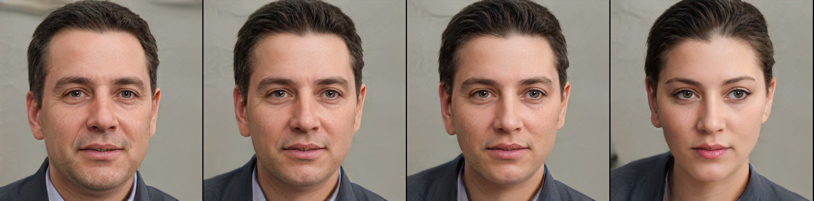
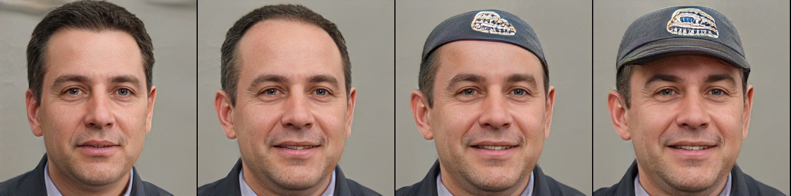

## STGAN-WO

**Towards Disentangling Latent Space for Unsupervised Semantic Face Editing** 
Kanglin Liu and Gaofeng Cao and Fei Zhou and Bozhi Liu and Jiang Duan and Guoping Qiu 

Paper:https://arxiv.org/abs/2011.02638 

Implementation of STGAN-WO
We have introduced the weightde decomposition technique as a replacement of weight demodulation, and constrain the weight matrix using orthogonal regularization, then proposed the structure-texture independent architecture to conduct the image synthesis, which hierarchically generates the structure and texture parts independently for the purpose of better attribute disentanglement
 
This project inherits from [StyleGAN](https://github.com/NVlabs/stylegan2)
## Requirements

* Both Linux and Windows are supported. Linux is recommended for performance and compatibility reasons.
* 64-bit Python 3.6 installation. We recommend Anaconda3 with numpy 1.14.3 or newer.
* TensorFlow 1.14 or 1.15 with GPU support. The code does not support TensorFlow 2.0.
* On Windows, you need to use TensorFlow 1.14 &mdash; TensorFlow 1.15 will not work.
* One or more high-end NVIDIA GPUs, NVIDIA drivers, CUDA 10.0 toolkit and cuDNN 7.5. To reproduce the results reported in the paper, you need an NVIDIA GPU with at least 16 GB of DRAM.
* Docker users: use the [provided Dockerfile](./Dockerfile) to build an image with the required library dependencies.

##Using pre-trained networks

Pre-trained networks are stored as `*.pkl` files on the [Google Drive folder](https://drive.google.com/file/d/1HXwkTNBjQOqgLtuCREpyG2o3ECqY_nsN/view?usp=sharing).
# generate face images 

python generate_figures.py

change z_2 would affect structure component related attributes like:

moving w1 along its orthogonal directions can edit attributes individually:

##Preparing datasets

Datasets are stored as multi-resolution TFRecords, similar to the [StyleGAN](https://github.com/NVlabs/stylegan). Each dataset consists of multiple `*.tfrecords` files stored under a common directory.

Besides, STGAN-WO utilizes the structure-texture independent architecture to conduct the image synthesis which hierarchically generates the structure and texture parts independently. Face images of coarse resolutions are the structure parts, which is obtained by I - I^t. You can obtain the structure and texture components using corresponding algprithms, or download from  [Structure-components](https://drive.google.com/file/d/1XTh2m0lI3p3-6zsQyii7voTEzT_ksPXk/view?usp=sharing).

The dataset file should be like this:

datasets folder:

| &boxvr;&nbsp; -r3.tfrecords

| &boxvr;&nbsp; -r4.tfrecords

| &boxvr;&nbsp; -r5.tfrecords

| &boxvr;&nbsp; -r6.tfrecords

| &boxvr;&nbsp; -r9.tfrecords

r3.tfrecords-r6.tfrecords are the structure components of corresponding resolutions, r9.tfrecords is the RGB images.

## Train networks

python train.py

## Evaluate metrics

python run_metrics.py

